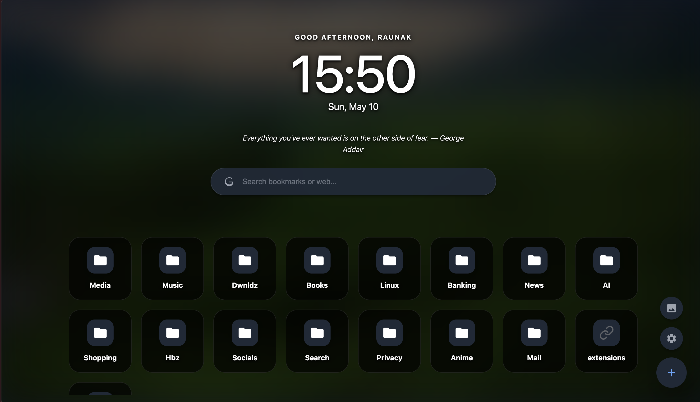

# Mosaic Home

Mosaic Home is a high-performance, minimalist Chrome extension that transforms your "New Tab" page into a sleek, organized, and personalized dashboard.



## 🚀 Features

- **Personalized Experience:** Dynamic greetings (Morning/Afternoon/Evening) and name personalization.
- **Inspiring Quotes:** A library of 100+ motivational quotes, randomized every time you open a new tab.
- **Super-Contrast UI:** Ultra-bold typography and solid "glass" tiles ensure 100% legibility over any background.
- **Search Engine Selector:** Switch between Google, DuckDuckGo, Bing, GitHub, and YouTube with simple shortcuts (`Tab` or `!g `).
- **Advanced Keyboard Navigation:** Full arrow key and shortcut support (`/` to search, `Esc` to close modals, `Enter` to navigate) for rapid bookmark access.
- **Search Query Highlighting:** Visual markers for matches when searching through your bookmarks.
- **Glassmorphism Design:** Modern, translucent UI components with adjustable backdrop blur.
- **Persistent Favicon Cache:** Bookmarks load instantly and work offline thanks to local icon caching.
- **Custom Backgrounds:** Upload personal wallpapers with a built-in "Reset" feature and "Reduce Motion" mode.
- **Hide Bookmarks Bar:** Option to hide the browser's native bookmarks bar content from the dashboard to prevent duplicate icons.
- **Settings Backup:** Export and import your configuration as a JSON file.
- **Privacy First:** 100% local processing; uses Chrome's native APIs for all data.

## 🛠️ Installation & Local Development

This project uses **Vite** for fast, modern web development and asset bundling.

### Setting up the Environment

1. Clone or download this repository.
2. Ensure you have Node.js installed.
3. Install the dependencies:
   ```bash
   npm install
   ```

### Running Locally (Dev Server)

While you can load the unpacked extension directly from the source code, you can also spin up the Vite development server to quickly iterate on UI components in your browser (note: Chrome Extension native APIs will mock or fail in standard web context without polyfills):

```bash
npm run dev
```

### Loading into Chrome

1. Build the project using `npm run build`. This generates an optimized, minified `dist/` directory.
2. Open Chrome and navigate to `chrome://extensions/`.
3. Enable **Developer mode** (toggle in the top right).
4. Click **Load unpacked** and select the newly created `dist/` directory.

## 📦 Building for Production

To create a production zip file ready for the Chrome Web Store:

```bash
npm run build
```

This command will bundle the extension via Vite, output the compiled assets into `dist/`, and create a `mosaic-home.zip` file containing everything needed.

### Automated CI/CD (GitHub Actions)

Every push to `main` generates a production-ready artifact in the **Actions** tab. Tags (e.g., `v1.1.0`) trigger automated GitHub Releases.

## ⚙️ Project Structure & Coding Standards

This project uses a clean **ES Module** architecture, grouping related features into distinct files. Coding standards are strictly enforced through Husky git hooks:

### JavaScript Files

- `js/app.js`: Main orchestrator and UI event binder.
- `js/state.js`: Centralized state management.
- `js/dom.js`: Cached DOM element references.
- `js/ui.js`: Stateless rendering components.
- `js/settings.js`: Settings persistence and import/export logic.
- `js/backgroundManager.js`: Image processing, compression, and background updates.
- `js/search.js`: Recursive search algorithms.
- `js/searchEngineManager.js`: Search engine cycling and dropdown rendering.
- `js/modalManager.js`: Core modal navigation logic.
- `js/widgets.js`: Self-contained widget logic (Clock, Quotes).

### CSS Files

- `css/base.css`: CSS variables, global resets, typography, and background overlays.
- `css/layout.css`: Main screen flexbox, grid container structure, and FAB positioning.
- `css/components.css`: Search bar, buttons, dropdowns, and individual grid items (tiles).
- `css/widgets.css`: Clock, greeting, and quote styling.
- `css/modals.css`: Modals, backdrops, and settings-specific UI.

### Quality Enforcements

- **Vite Bundler:** Compiles and maps dependencies, ensuring compliance with Manifest V3 Content Security Policies.
- **Linting & Formatting:** Enforced via `ESLint` and `Prettier`. Run `npm run lint` or `npm run format` manually if needed.
- **Conventional Commits:** All commit messages must follow the [Conventional Commits](https://www.conventionalcommits.org/en/v1.0.0/) specification, validated locally by `commitlint` before every commit.
- **Native APIs:** Strictly uses Chrome's native APIs (`bookmarks`, `storage`, `tabs`) to ensure stability.

## 🗺️ Roadmap

We track planned improvements via [GitHub Issues](https://github.com/your-repo-owner/mosaic-home/issues). Major upcoming items include:

- **Speed-Dial Pins:** Fixed "Quick Access" row for top bookmarks.
- **Pomodoro Widget:** Built-in productivity timer.
- **Bulk Actions:** Mass moves or deletes for bookmarks.
- **Custom Sorting:** Sort by name, date, or usage frequency.

## 🤝 Contributing

1. Fork the repo.
2. Create a feature branch.
3. Make sure your changes pass all checks (`npm run lint` and `npm test`).
4. Commit following the Conventional Commits format.
5. Submit a PR!

## 📄 License

MIT License - see the [LICENSE](LICENSE) file for details.
